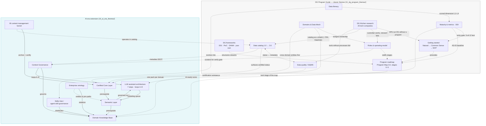
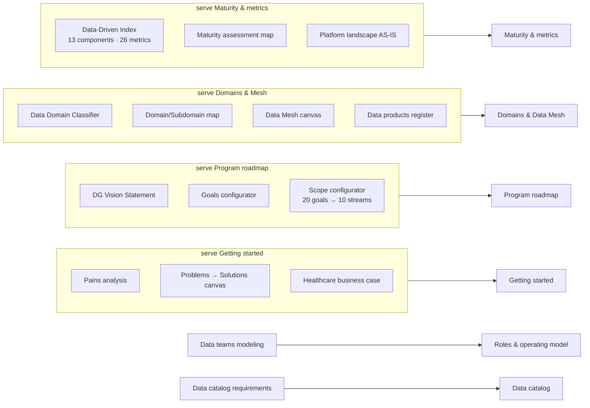
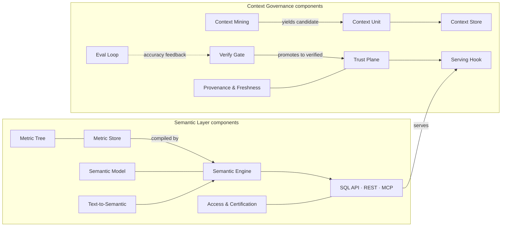
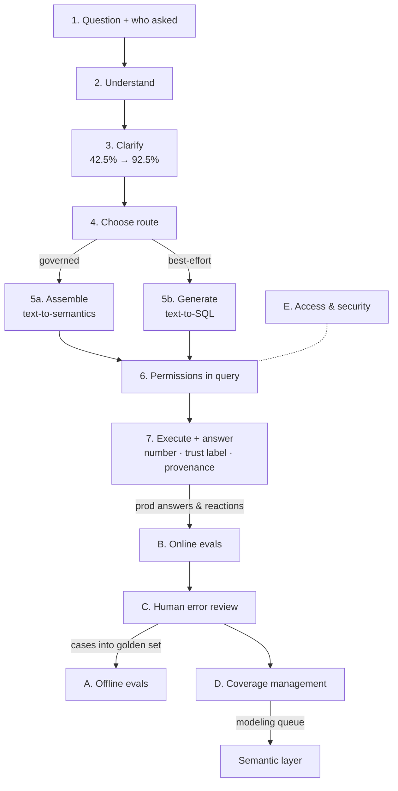
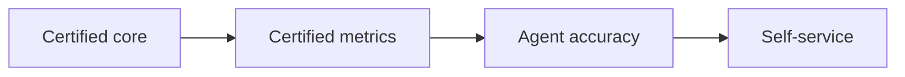

# Visual graph

Rendered from `objects.yaml`. GitHub renders these Mermaid blocks natively.
Solid arrows — relations drawn on the board or stated in its texts; dotted arrows — inferred by content logic (kept separate in `objects.yaml` under `inferred_relations`).

## Board-level dependency graph

Reading order for strategy building: maturity self-assessment gates entry → getting started seeds the roadmap, structured by a framework and staffed by roles → the AI-era chain is the prerequisite triad `Certified Core Layer → Semantic Layer → Domain Knowledge Base`, wrapped by Context Governance and operated through the LLM assistant architecture, whose coverage loop feeds work back into the semantic layer.

## Templates → themes

## AI-era component detail

## Runtime and feedback loops (LLM assistant architecture frame)

## Dependency chain (the budget-defense line)

