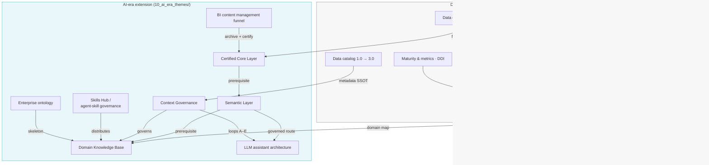
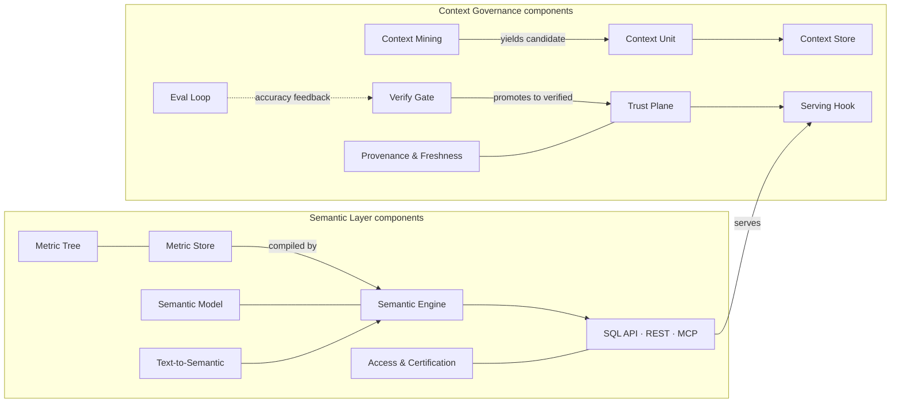
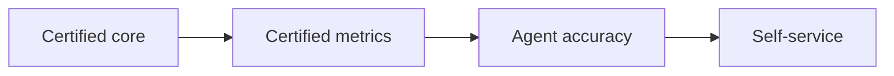

# Visual graph

Rendered from `objects.yaml`. GitHub renders these Mermaid blocks natively.

## Board-level dependency graph

Reading order for strategy building: bottom of the classic block gives the program skeleton (getting started → roadmap), the AI-era chain is the prerequisite triad `Certified Core Layer → Semantic Layer → Domain Knowledge Base`, wrapped by Context Governance and operated through the LLM assistant architecture.

## AI-era component detail

## Dependency chain (the budget-defense line)

